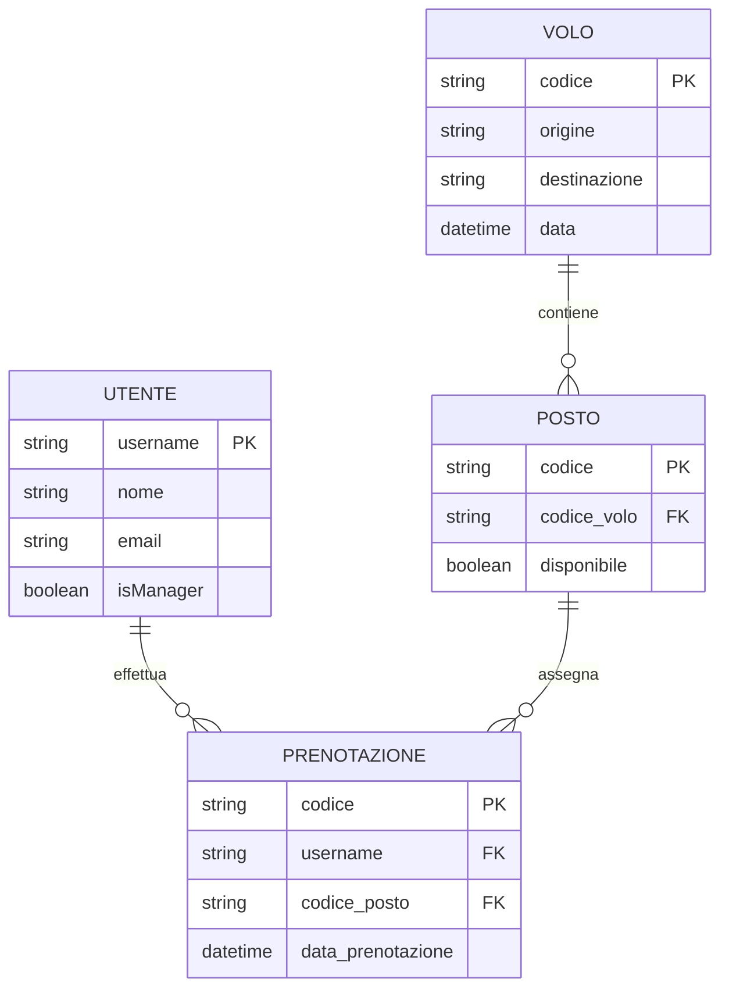
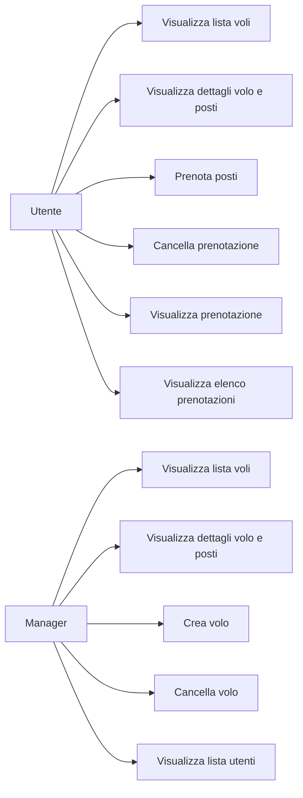

# **Dominio: Prenotazione posto aereo**

## **Descrizione del sistema**

Il sistema consente agli utenti di prenotare posti su voli aerei selezionando tra quelli disponibili. Gli utenti possono visualizzare i voli, i posti liberi e gestire le proprie prenotazioni. I manager possono creare e cancellare voli e accedere alla lista degli utenti.

---

## **Requisiti Funzionali** (in formato *User Story*)

1. **Come cliente**, voglio prenotare uno o più posti su un volo disponibile, **per viaggiare nella data desiderata**.
2. **Come utente**, voglio cancellare una mia prenotazione, **per modificare i miei piani di viaggio**.
3. **Come utente**, voglio visualizzare una mia prenotazione, **per verificarne i dettagli**.
4. **Come utente o manager**, voglio visualizzare la lista dei voli disponibili, **per consultare le opzioni di viaggio**.
5. **Come utente o manager**, voglio visualizzare i dettagli di un volo, inclusi i posti ancora disponibili, **per valutare la disponibilità**.
6. **Come utente**, voglio visualizzare la lista delle mie prenotazioni, **per avere una panoramica dei miei viaggi**.
7. **Come manager**, voglio creare nuovi voli, **per offrire nuove rotte agli utenti**.
8. **Come manager**, voglio cancellare voli esistenti, **per gestire l’operatività della compagnia**.
9. **Come manager**, voglio visualizzare la lista degli utenti registrati, **per monitorare le attività nel sistema**.

---

## **Diagramma ER (Entity-Relationship)**

---

## **Casi d’Uso (Diagramma UML semplificato)**

